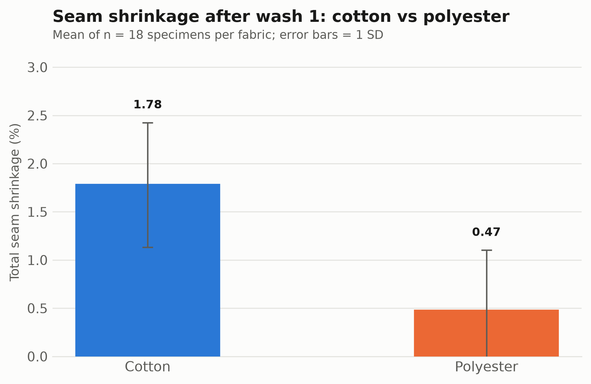
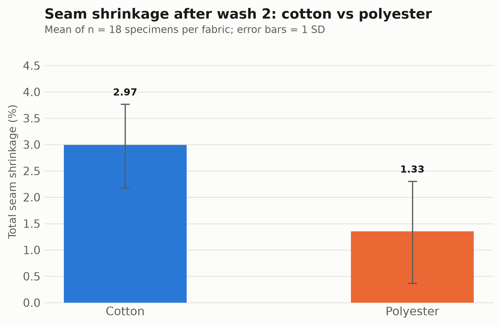
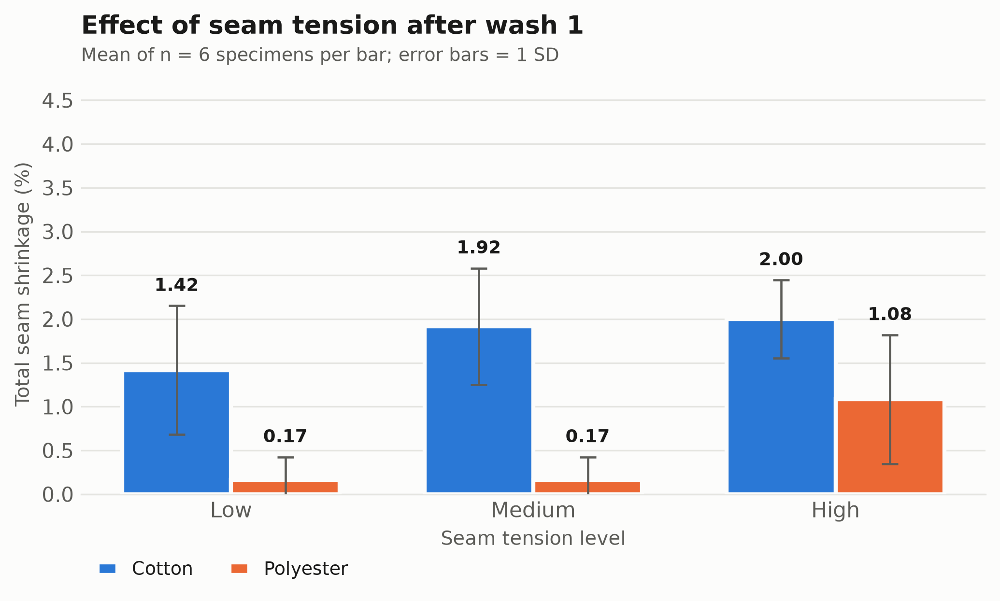
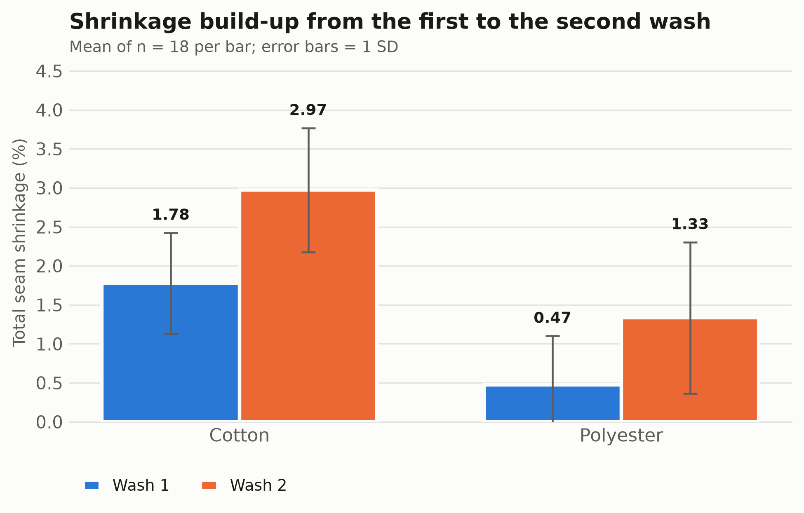

# Effect of Yarn and Fabric Parameters on Seam Shrinkage

Statistical analysis of seam shrinkage (*abraftegi* / آبرفتگی دوخت) in **cotton** and **polyester**
fabrics, measured after the **first** and **second** wash cycle.

Seam shrinkage is the dimensional contraction that appears along a stitched line after laundering.
It degrades garment appearance even when the individual fabric panels are dimensionally stable,
because the sewing thread, the fabric and the stitch geometry relax at different rates. This
repository contains the complete, reproducible analysis pipeline — from the raw measurement
workbook to the finished reports, in **English and Persian**.

---

## Research questions

1. Does the **fabric type** (cotton vs polyester) change the amount of seam shrinkage?
2. Does the **seam tension level** (low / medium / high) change the amount of seam shrinkage?
3. Does the **wash number** (first vs second wash) change the amount of seam shrinkage?
4. *(supplementary)* Does the **sewing-thread yarn count** (Ne 20 vs Ne 40) matter?

---

## Experimental design

A balanced full factorial design — no missing values:

| Factor | Levels | Values |
|---|---|---|
| Fabric type | 2 | Cotton, Polyester |
| Sewing-thread yarn count | 2 | Ne 20, Ne 40 |
| Seam tension level | 3 | Low (کم), Medium (متوسط), High (زیاد) |
| Replicates | 3 | 1, 2, 3 |
| Wash cycle *(repeated measure)* | 2 | Wash 1, Wash 2 |

2 × 2 × 3 = **12 experimental cells** × 3 replicates = **36 sewn specimens**, each measured after
both washes → **72 shrinkage observations**.

**Response variable:** total seam shrinkage (%), computed from a 200 mm marked seam length before
and after washing. Values are recorded on a 0.5 % measurement grid — the practical resolution of
the method.

**Sample codes** are structured: `C20L-1` = **C**otton, Ne **20**, **L**ow tension, replicate **1**
(`P` = polyester, `S` = medium/standard tension, `H` = high tension).

Control specimens (`Control 1–3`) and bare-spool rows were excluded from the statistical tests:
they carry a 1–5 assessor rating rather than a measured shrinkage percentage.

---

## Key results

| Factor | F | p | η² | Conclusion |
|---|---|---|---|---|
| **Fabric type** | F(1, 70) = 45.44 | < 0.001 | 0.394 | **Significant** — cotton 2.38 % vs polyester 0.90 % |
| **Seam tension** | F(2, 69) = 3.21 | 0.047 | 0.085 | **Significant** (pooled) |
| **Wash number** | F(1, 70) = 16.62 | < 0.001 | 0.192 | **Significant** — 1.13 % → 2.15 % |
| Yarn count | F(1, 70) = 0.80 | 0.373 | 0.011 | Not significant |

Three findings worth highlighting:

- **Fibre type dominates.** It alone explains ~39 % of all variance in seam shrinkage, and the
  effect holds after the first *and* the second wash considered separately. Cotton's hygroscopic
  swelling and stress relaxation drive it; heat-set polyester largely retains its dimensions.

- **The tension effect is almost entirely a polyester phenomenon** — an interaction.
  Split by fabric: polyester F(2, 33) = 13.10, p < 0.001; cotton F(2, 33) = 0.44, p = 0.65.
  Bonferroni post-hoc localises it at the **high** setting only (low-vs-medium never differs).
  In cotton, fibre-driven shrinkage masks the stitch-tension contribution; in dimensionally stable
  polyester, the elastic strain stored in an over-tensioned seam becomes the main mechanism.

- **One wash cycle is not enough.** Shrinkage grew from 1.13 % to 2.15 %, and **all 36 specimens**
  shrank further at the second wash. Because the two washes are repeated measures on the same
  specimens, a paired t-test is also reported: +1.03 ± 0.64 pp, t(35) = 9.59, p < 0.001.

### Assumptions and robustness

Levene's test was non-significant for all reported models except tension-within-polyester (the
near-zero variance of the low/medium cells inflates the statistic). Shapiro–Wilk rejects normality
in most groups — expected rather than alarming, since the response is recorded on a discrete 0.5 %
grid and is therefore heavily tied. Every test was repeated with the rank-based **Kruskal–Wallis**
test and **every conclusion is reproduced**, so no finding depends on the normality assumption.

---

## Figures

<p align="center">
  
  
</p>
<p align="center">
  
  
</p>

All charts are 300 dpi PNG, with group means, one-SD error bars and printed value labels.

---

## Repository structure

```
.
├── دوک ها و پارچه ها - اصلاحیه9.xlsx   Source measurement workbook (6 sheets)
├── analysis.py                          Full English pipeline (data → stats → charts → report)
├── persian_outputs.py                   Full Persian pipeline (charts, workbook, both documents)
│
├── Seam_Shrinkage_Report.docx           English report: tables, charts, ANOVA, conclusion
├── Descriptive_Statistics.xlsx          English tables + ANOVA + post-hoc + Kruskal–Wallis
├── fig1…fig7*.png                       English charts (300 dpi)
├── tidy_data_wide.csv                   Cleaned data, one row per specimen (36 rows)
├── tidy_data_long.csv                   Cleaned data, one row per observation (72 rows)
│
└── Persian/                             Complete Persian (RTL) edition
    ├── راهنمای_کامل_پروژه.docx           Study & presentation guide (see below)
    ├── گزارش_تحلیل_آماری.docx            Formal statistical report
    ├── آمار_توصیفی_و_نتایج_آزمون‌ها.xlsx   All tables, RTL sheet views
    └── نمودار۱…۷*.png                     Persian charts (300 dpi)
```

### The Persian study guide

`Persian/راهنمای_کامل_پروژه.docx` is written for a student who has to *present* this work. It
explains, in plain Persian: what seam shrinkage is, what every sheet and column of the source
workbook contains, how the response variable is computed, which rows were excluded and why, and
each statistical concept used (error bars, the null hypothesis, what a p-value does and does **not**
mean, the F statistic, η² and Cohen's d, Bonferroni correction, Levene / Shapiro–Wilk,
Kruskal–Wallis, the paired t-test). It then walks through **all seven charts one by one**, adds the
physical interpretation of each finding, a suggested 10-slide structure, three key sentences to
memorise, and a table of **eight likely examiner questions with prepared answers**.

---

## Methods

Descriptive statistics → one-way **ANOVA** for each factor (pooled and within sub-groups) →
**Bonferroni**-corrected pairwise post-hoc tests for the 3-level tension factor → **paired t-test**
for the repeated-measures wash factor → **Kruskal–Wallis** non-parametric confirmation.
Effect sizes (η², Cohen's d) are reported alongside every p-value. Significance level α = 0.05.

## Reproducing the analysis

Requires Python 3.11+.

```bash
pip install pandas scipy matplotlib python-docx openpyxl

python analysis.py           # English outputs
python persian_outputs.py    # Persian outputs (imports the same computations)
```

Every number in both reports is generated from the same computation, so editing the source workbook
and re-running regenerates all tables, charts and report text consistently. If an output file is
open in Word or Excel the scripts stop with a clear message asking you to close it.

**Note on Persian charts:** matplotlib ≥ 3.11 performs Arabic-script shaping and bidi reordering
natively, so Persian labels are passed as raw text. On older matplotlib, set `RESHAPE=1` to fall
back to manual shaping via `arabic-reshaper` + `python-bidi`.

---

## Limitations

- Small sample: only 3 replicates per experimental cell.
- Measurement resolution is 0.5 %; finer differences are undetectable.
- One stitch type and two yarn counts only — generalisation beyond this range needs more trials.
- The fabric × tension interaction is shown by sub-group analysis, not by a full factorial ANOVA;
  quantifying it properly requires a larger design.
- Wash conditions (temperature, detergent, cycle count) were held fixed and not studied.
